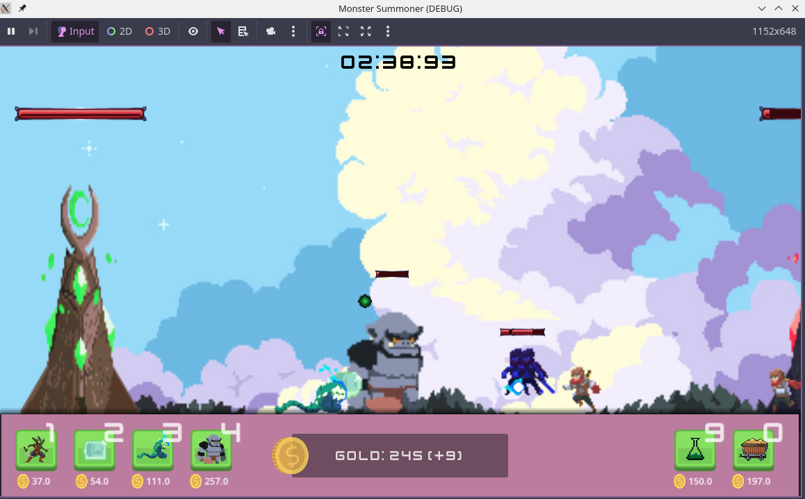

# [Monster Summoner]

[A simple game where you deploy troops strategically to see them demolish the enemy!]

## Features

- [5 Factions]
- [5 Random Levels]
- [Semi-auto battler]
- [Slight resource management]

## Screenshots

  

## Getting Started

### Requirements

- Download and run from https://github.com/Li05j/MonsterSummoner/tags
- Or, to build and run it locally:

### Running the Project

1. Clone the repository:
   ```bash
   git clone https://github.com/Li05j/MonsterSummoner.git
2. Open the project in Godot.
3. Press Play.

### Credits
See `credits.txt` for the full list. Thanks to all the creators who made their resources freely available.
